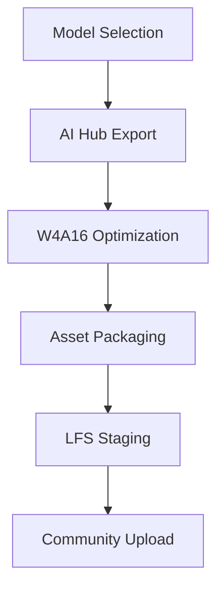

The landscape of on-device AI is evolving rapidly, and the release of **Qwen3-4B** (often referred to as Qwen3.5 in recent community discussions) marks a significant milestone. In this post, I’ll take you through the details of this state-of-the-art model and the precise workflow I followed to contribute it to the **Qualcomm AI Hub Community**.

<!-- truncate -->

## The Journey

Contributing a model to the Qualcomm AI Hub Community Space on Hugging Face requires structural precision to ensure the assets are deployable by others. 

### Why Qwen3?
The Qwen3-4B model excels in **reasoning, math, and coding**, outperforming many models in its size class. On a flagship platform like the **Snapdragon 8 Elite (QCS9075)**, it delivers impressive **Time To First Token (TTFT)** and sustainable response rates.

### The Technical Map

### Overcoming Challenges
Large model contributions (15GB+) often hit snags. During the upload, we encountered:
- **Git LFS Configuration**: Ensuring `.gitattributes` correctly tracked the massive zip file.
- **Authentication**: Navigating Hugging Face's `403 Forbidden` errors by switching from fine-grained tokens to a standard **Write** token.

Stay tuned for more on-device AI guides!

---

*The model is now available at [qualcomm-ai-hub-community/Qwen3-4B-Instruct-carrycooldude](https://huggingface.co/qualcomm-ai-hub-community/Qwen3-4B-Instruct-carrycooldude).*
