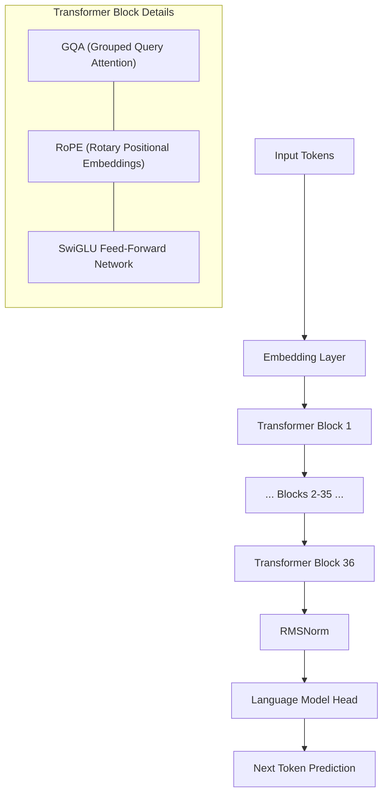

# Qwen3-4B Architecture

Deep dive into the architecture of Qwen3-4B and how it is optimized for mobile deployment.

## Model Summary
Qwen3-4B is a state-of-the-art causal language model with 4 billion parameters. It is designed to be efficient yet powerful, suitable for on-device applications.

## Key Architectural Highlights

### 1. Hybrid Attention (GQA)
Qwen3-4B utilizes **Grouped Query Attention (GQA)**. GQA significantly reduces memory bandwidth requirements during inference by sharing keys and values across multiple query heads. This is critical for on-device deployment where memory bandwidth is often the primary bottleneck.

### 2. Thinking vs. Non-Thinking Modes
The model supports two distinct execution paths:
- **Thinking Mode**: Optimized for complex logical reasoning, mathematics, and code generation. It allows for internal "contemplation" before outputting the final tokens.
- **Non-Thinking Mode**: Built for speed and general conversational fluency. Ideal for standard chat and creative writing.

### 3. RoPE & SwiGLU
- **RoPE (Rotary Positional Embeddings)**: Enables better handling of long-context dependencies.
- **SwiGLU Activation**: Provides superior non-linearity compared to standard ReLU or GELU, leading to better model convergence and performance.

## Hardware Optimization (W4A16)
The architecture is deployed using **W4A16 quantization** (4-bit Weights, 16-bit Activations). This allows the massive model to fit into ~2GB of RAM on Snapdragon devices while maintaining high precision for activation-sensitive reasoning tasks.
