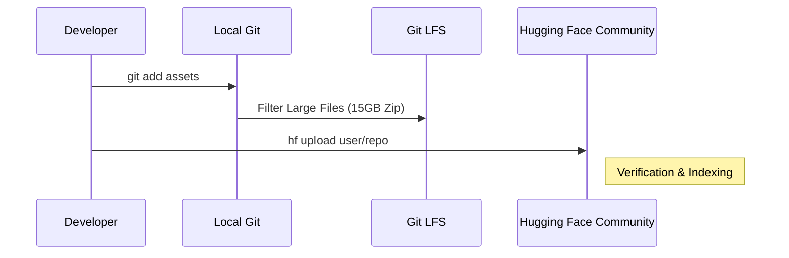

# Community Contribution Workflow

Step-by-step guide on how to contribute your optimized models to the Qualcomm AI Hub Community.

## Overview
Contributing to the community ensures that high-quality, optimized models are accessible to all developers. The workflow follows a strict structural requirement to maintain compatibility with the AI Hub web interface.



## Step 1: Repository Structure
Each model must be placed in its own repository with the following structure:

```text
<repo-name>/
    ├── README.md
    ├── LICENSE
    ├── .gitattributes (for LFS)
    └── <model_name>-<runtime>-<precision>.zip
```

### tool_versions.yaml
Each zip file MUST include a `tool_versions.yaml` inside the archive:
```yaml
tool_versions:
  aihm_version: 0.48.0
  qairt: 2.34.0
```

## Step 2: Strategic Upload (Large Files)
For files exceeding 5GB, standard `git push` may fail due to network timeouts. We recommend using the `hf` CLI:

```bash
# Login with a 'Write' permission token
hf auth login

# Upload the entire folder
hf upload qualcomm-ai-hub-community/Qwen3-4B-Instruct-carrycooldude . 
```

## Step 3: Metadata Validation
After upload, verify that the README tags match the model capabilities:
- `tags: [qualcomm, ai-hub, on-device]`
- `base_model: Qwen/Qwen3-4B`
