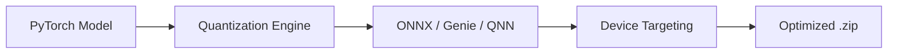

# Export & Optimization Guide

Learn how to export Qwen3-4B using the Qualcomm AI Stack for on-device performance.

## Prerequisites
- Qualcomm AI Hub account
- Python 3.10+
- `qai-hub-models` package (version >= 0.48.0)

## The Export Pipeline

The model undergoes several stages to transform from a high-level `transformers` model into an optimized mobile asset.



## Export Command

Run the following command to initiate the export process for the **Snapdragon 8 Elite** (QCS9075) chipset:

```bash
python -m qai_hub_models.models.qwen3_4b.export \
  --target-runtime genie \
  --chipset qcs9075 \
  --zip-assets \
  --output-dir ./output
```

### Key Arguments:
- `--target-runtime`: Specifies the runtime (Genie or QNN).
- `--chipset`: The target hardware platform.
- `--zip-assets`: Automatically packages the assets into the community-compliant zip format.

## Troubleshooting

### Large Asset Hashing
When dealing with the 17.6GB model data file, zipping and hashing can take significant time. Ensure your system has:
- At least 40GB of free disk space.
- Stable power for long-running compression tasks.

### Asset Validation
Always verify the integrity of the generated ONNX files before upload:
```bash
python -m onnx.checker --check-model model.onnx
```
